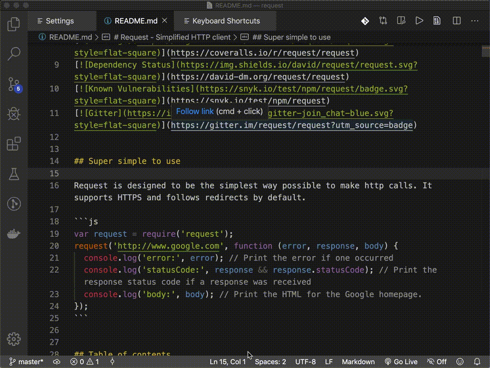
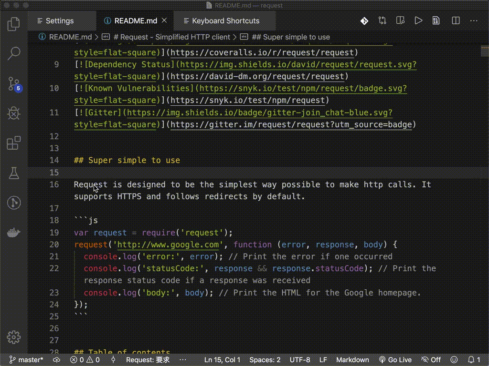
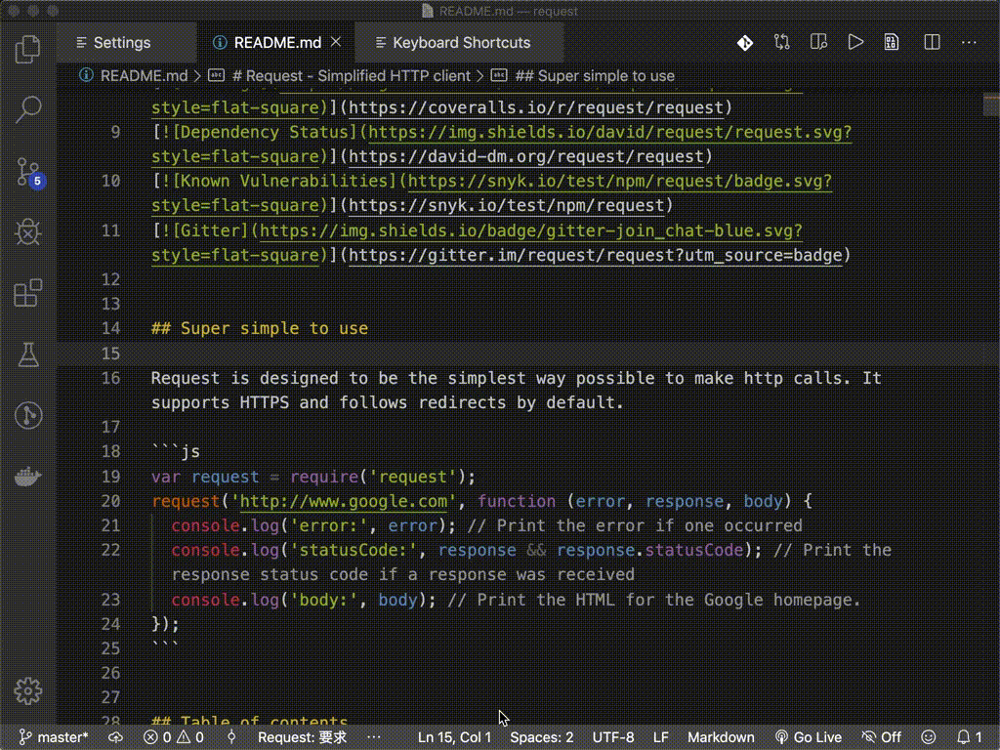
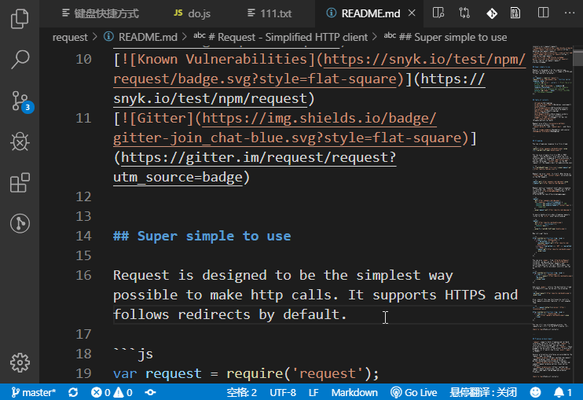
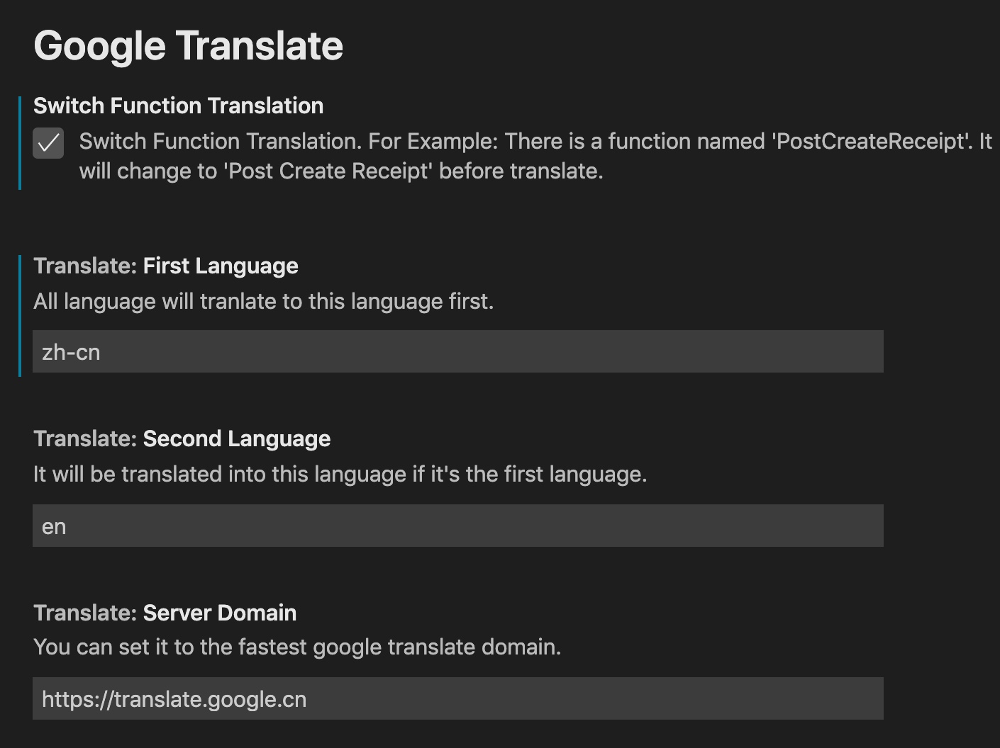

[English Readme](README.md) / [简体中文说明](README.zh-cn.md) / 繁體中文說明

# Google Translate Extension

基於 [Google 翻譯(cn)](https://translate.google.cn)，無需科學上網，無需 API Key 的翻譯擴展。

❤ [Sponsor me](https://www.paypal.me/imlinhanchao) / [赞助开发者](http://sponsor.hancel.org/)

## Features

包含以下功能：

1. 自動語言互譯 `Ctrl + Shift + T`；  
   
2. 翻譯並復制結果到剪貼板 `Alt + T`；  
   
3. 展開候選詞選擇 `Shift + Alt + T`；  
      
4. 翻譯並替換 `Ctrl + Alt + T`；  
   
5. 懸停翻譯選中文字；  
   
6. 設置界面，可設置翻譯的目標語言
   
7. 暫時切換到其他翻譯語言，直到關閉工作空間或修改配置。 `google-translate.switch`

> Tips: 快捷鍵修改可以到 VSCode 的鍵盤快捷方式 ( `Ctrl + K Ctrl + S` ) 修改。

## Notice

Linux 用戶須安裝 xsel，用於支援剪貼板功能。（感謝 [hawk hu](https://github.com/hawkhu) 的提醒）

Ubuntu：
```bash
sudo apt install xsel
```

CentOS
```bash
sudo yum install epel-release.noarch
sudo yum install xsel
```

## Release Notes

### 1.2.0
1. 更新切換目標更改語言以保存設置。
2. 添加了檢測語言設置命令。
3. 添加交換第一和第二語言命令。
4. 添加目標語言和檢測語言設置狀態欄。

### 1.1.5
1. 修復了無法自動在 MacOS 和 Linux 上啟動擴展名主頁的問題。

### 1.1.4
1. 添加設置項目 `max Size Of Result` 設置狀態欄和消息框翻譯內容與結果的最大顯示字符。

### 1.1.3
1. 修復第一語言非中文時，翻譯結果為空的問題。
2. 加入可臨時切換翻譯語言的功能。
   
### 1.1.2
1. 修復一些大量文本翻譯的操作與顯示問題。

### 1.1.1
1. 更新擴展描述；

### 1.1.0
1. 新增設置界面，可配置目標翻譯語言等；
2. 新增函數名翻譯功能；
3. 提示語支持多語言；
4. 修正若幹已知 Bug；

### 1.0.10
1. 更新請求庫為 got, 避免壹些兼容性問題。

### 1.0.9
1. 加入內部錯誤提示，方便用戶反饋 Issue。

### 1.0.8
1. 移除 Request 和 URLEncode 依賴，改用原生模塊，減少包大小。
2. 加入自動根據編輯器語言切換目標語言，若選中為當前編譯器語言的文字，則自動改為將其翻譯為英文。

### 1.0.7
1. 更新限定功能觸發條件，避免與 VSCode 的快捷鍵沖突。

### 1.0.6
1. 修復翻譯壹段文字時，只顯示第壹句的翻譯結果的問題。

### 1.0.5
1. 加入懸停顯示選中文本翻譯結果功能。

### 1.0.4
1. 加入將所選文字語言翻譯直接替換的指令。
2. 更新復制到剪切板和候選詞功能，無需在翻譯後才能執行。

### 1.0.3
1. 加入根據所選文字語言自動翻譯為中文；
  
### 1.0.2
1. 加入 Linux 註意事項說明；
   
### 1.0.1
1. 加入快捷鍵說明；

### 1.0.0
1. 支援 Google 翻譯中英互譯；

---

## For more information

* [GitHub](https://github.com/imlinhanchao/vsc-google-translate)
* [VSCode Market](https://marketplace.visualstudio.com/items?itemName=hancel.google-translate)
* Icon made by [Pixel perfect](https://www.flaticon.com/authors/pixel-perfect) from www.flaticon.com 
* Icons made by <a href="https://www.flaticon.com/authors/google" title="Google">Google</a> from <a href="https://www.flaticon.com/" title="Flaticon"> www.flaticon.com</a>

**Enjoy!**
